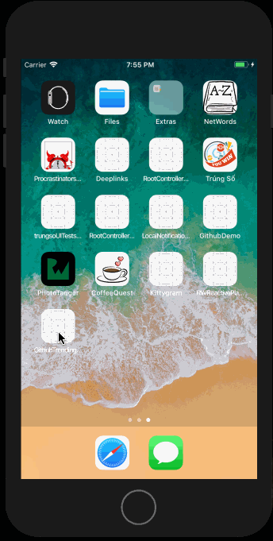

# GitHub Trending Projects

## User Stories

The following **required** functionality is completed:

- [x] List trending projects on Github
- [x] Tap on one of them, show their details
- [x] Follow the design of the project as attached in the email
- [x] MVVM- Swift 3.2 or later

<table>
	<tr>
		<td width="50%">
			
		</td>
		<td width="50%">
			
		</td>
	</tr>
</table>

The following **optional** features are implemented:

- [ ] ReactiveCocoa 6.0+ (Nice to have)

## Video Walkthrough

Here's a walkthrough of implemented user stories:

GIF created with [LiceCap](http://www.cockos.com/licecap/).

## Notes

**Trending Repos**: GitHub seems to use their API to write the trending page and don't present it back as a particular API. (for detail, please refer to this [stackoverflow page](https://stackoverflow.com/questions/30525330/how-to-get-list-of-trending-github-repositories-by-github-api))

There is a workaround, by scraping github trending page, as implemented at [huchenme/github-trending-api](https://github.com/huchenme/github-trending-api)

However, to keep it simple as demonstration purpose of this project, I assume that trending repos are:

- repos with most stars
- created within last 30 days

**Pagination**: Pagination and infiniive loading is not implemented as they are not requriements of project, thus max results is 30 by default.

## License

    Copyright [2018] [Dang Quoc Huy]

    Licensed under the Apache License, Version 2.0 (the "License");
    you may not use this file except in compliance with the License.
    You may obtain a copy of the License at

        http://www.apache.org/licenses/LICENSE-2.0

    Unless required by applicable law or agreed to in writing, software
    distributed under the License is distributed on an "AS IS" BASIS,
    WITHOUT WARRANTIES OR CONDITIONS OF ANY KIND, either express or implied.
    See the License for the specific language governing permissions and
    limitations under the License.
